# 📷 Aebox

**Aebox**是一款多功能aec辅助调试工具集合，采用 **Python + PyQt5** 实现，旨在为AEC模块的同事提供丰富的辅助调试的工具，提高aec模块的调试效率，降低aec模块的上手难度。集成Hiviewer看图工具后将提供更加完善的看调体验，方便工具的使用和后续的维护。

  
  
    
  </a>
    
    

# 下载请查看最新的release
> https://github.com/965962591/aebox_releases/releases

### AEbox工具联系方式：
- 外部：barrymchen@gmail.com
- 内部：chenyang3@longcheer.com

### Hiviewer工具联系方式：
- 外部：diamond_cz@163.com
- 内部：chenzhen@longcheer.com

## 🌟 贡献者

感谢以下贡献者：

| 头像 | 用户名 | 贡献 |
|:---:|:---:|:---:|
|  | [Barry](https://github.com/965962591) | AEBOX |
|  | [diamond-cz](https://github.com/diamond-cz) | Hiviewer |

## 🙏 特别感谢
特别感谢以下个人对本项目的支持（排名不分前后）：
- 钱黎金、仲汝兵、丁凡、王清政、洪先明、石春杰、斯成浩、朱安东、李志坤等同学的宝贵建议。

# 使用指南：

### 最新更新

#### mtk/unisoc更新(3.8.6.2)
- 初步支持mtk 7s的解析和参数调试（计算部分待完善，参数回写待开发，请在设置中切换6s/7s）
- mtk/unisoc的exif/thd/target table支持自定义exif tag显示
- 优化了一些已知的问题

#### RawYuv2jpg更新(3.8.5.8)
- 修复mtk packed word转jpg异常问题
- 修复高通mipi raw lsb/msb异常，新增lsb/msb设置选项
- 新增智能转换功能，将常见可能批量转换提供用户选择，可以将符合预期的配置设置为预设，方便后续转换
- 支持从raw名称中直接提取size
- **本次更新将表格tuning界面移除，此调试界面局限性较大，不能适应各种用户自定义sa场景，故移除请知悉。**
  
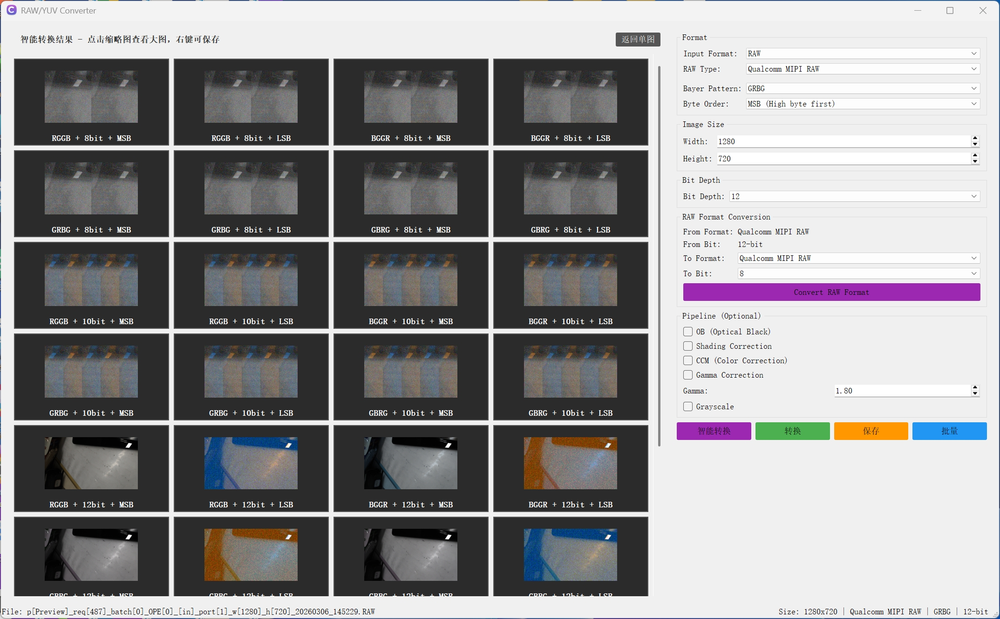 

#### fastapi->pyro5(3.8.5.4)
- fastapi在使用的过程中需要需要手动的维护ip和端口，对于单个软件打开多次会存在端口占用导致fastapi对应服务异常无法实现切图的问题，因此内置服务从fastapi替换成pyro5。
- pyro5无需手动管理ip和端口，名称服务器发现和连接速度快，对于单个程序启动多次，看图hiviewer工具可以同时控制。

> **pyro5整体的体验更优，fastapi在后续版本不再支持，此为破坏性更新，请使用最新工具**

#### 新增高通AECX蓝图编辑器(3.8.5.1)
- 通过full control检查器将AECX中的full control解析后保存成sa_config.json后使用蓝图编辑器支持完整full control可视化自定义和参数模拟。
- 主界面解析后的sa计算步骤点击，full control可视化界面支持聚焦对应流程节点。
- 右键菜单栏的3a完全控制启用后将支持完整的3a数据自定义，可以新增lux-target和lux-adjratio-adjratio的一维/二维参数调试节点。
- 支持流程全局视图（将所有sa显示在一个画布上
- 支持存在多个sa流程配置文件，支持切换并使用不同的流程配置
- 请注意，默认的full control节点的关系需要调试人员微调以适应自己的项目。
- **蓝图编辑器目前更新频率较高，会修复一些问题，修复会改变sa-config.json文件，为了规避异常，建议软件更新建议重新根据项目参数生成一下项目蓝图。**

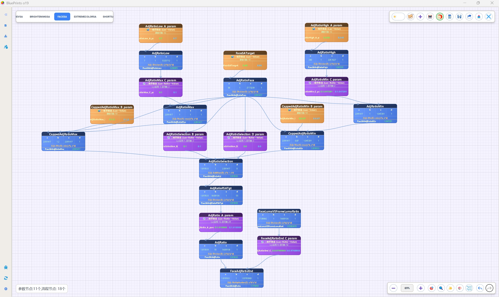

### 需求
- [x] 删除文件刷新修改的列
- [x] rust重构aecx的解析逻辑

#### 1、程序主页面

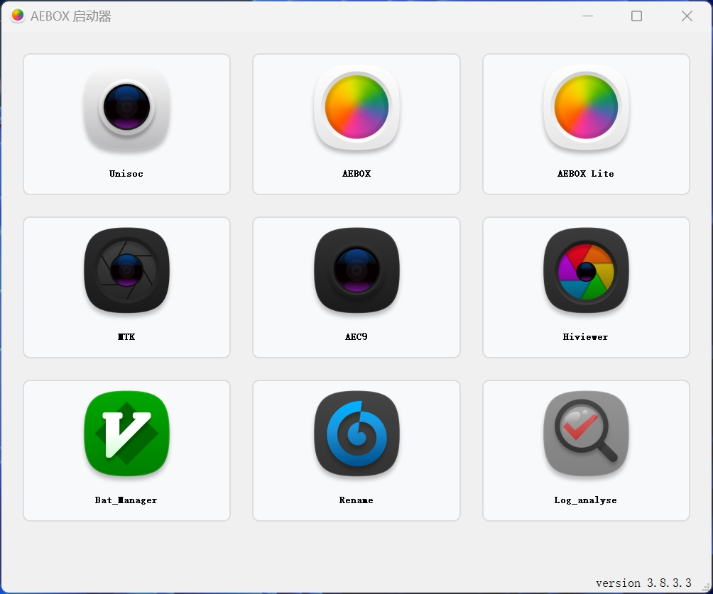

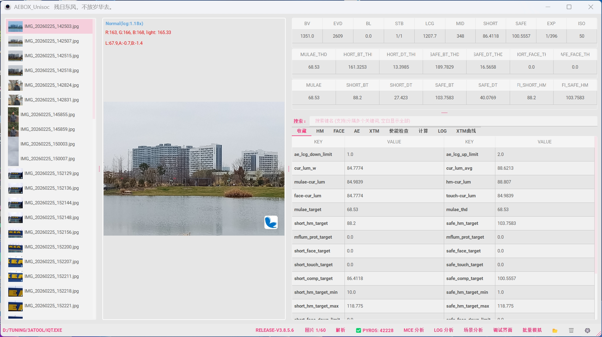
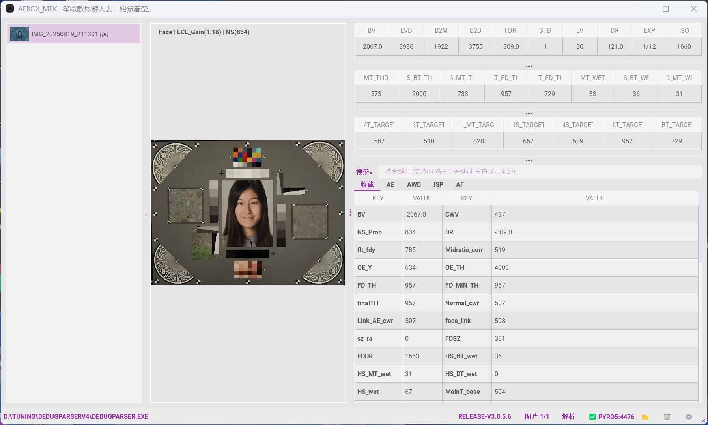
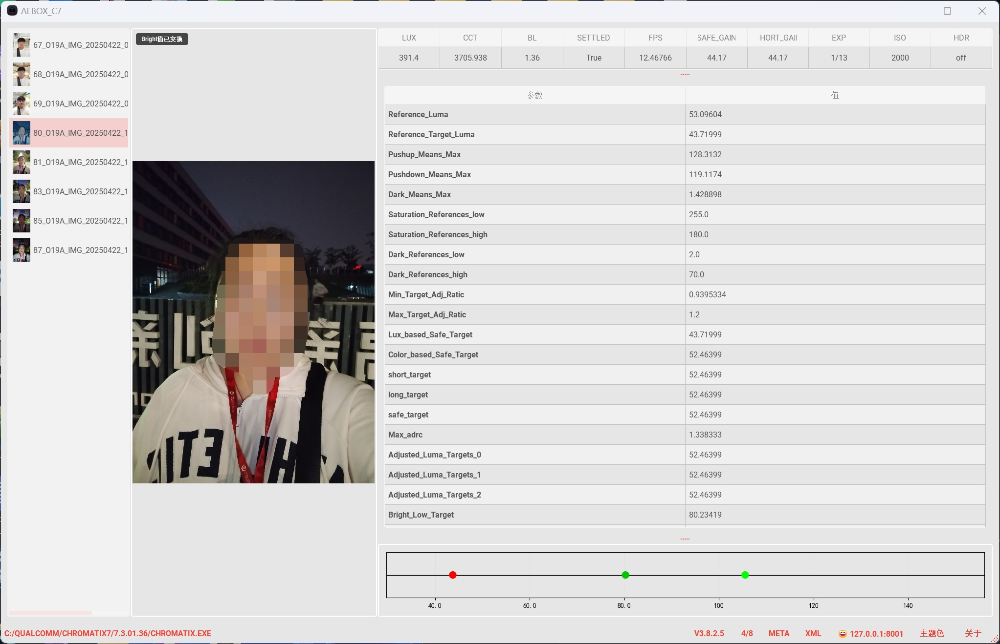
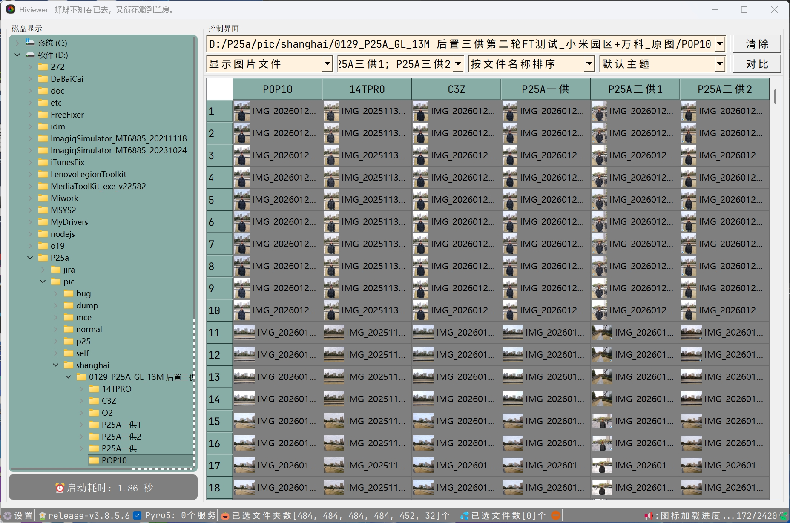
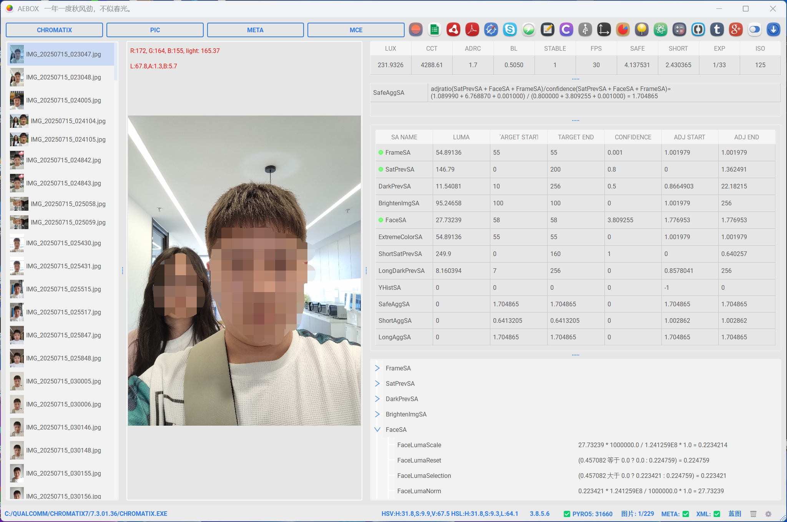

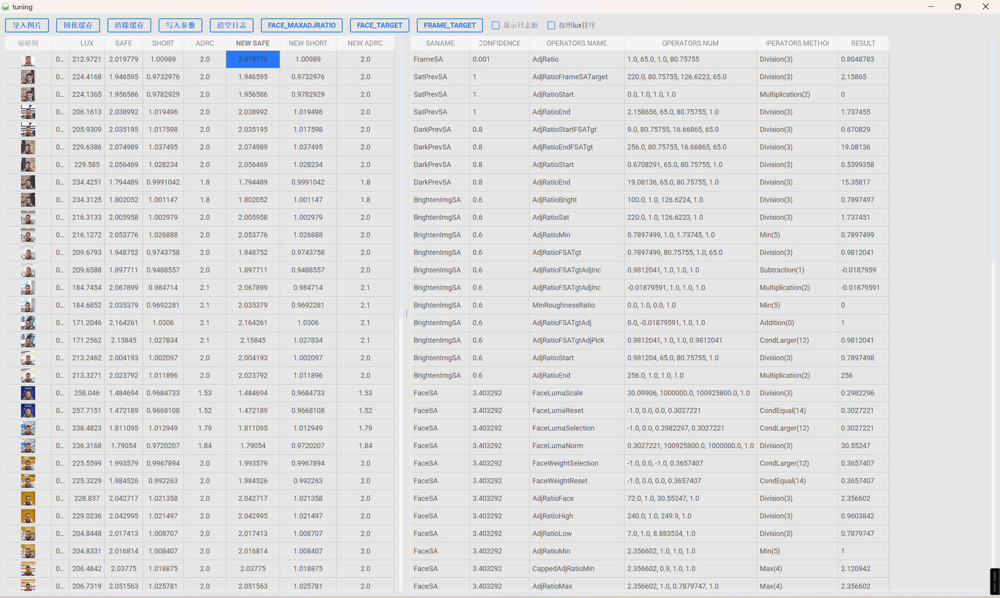

**增加aebox_lite更加轻量，专注于exif信息的显示。**
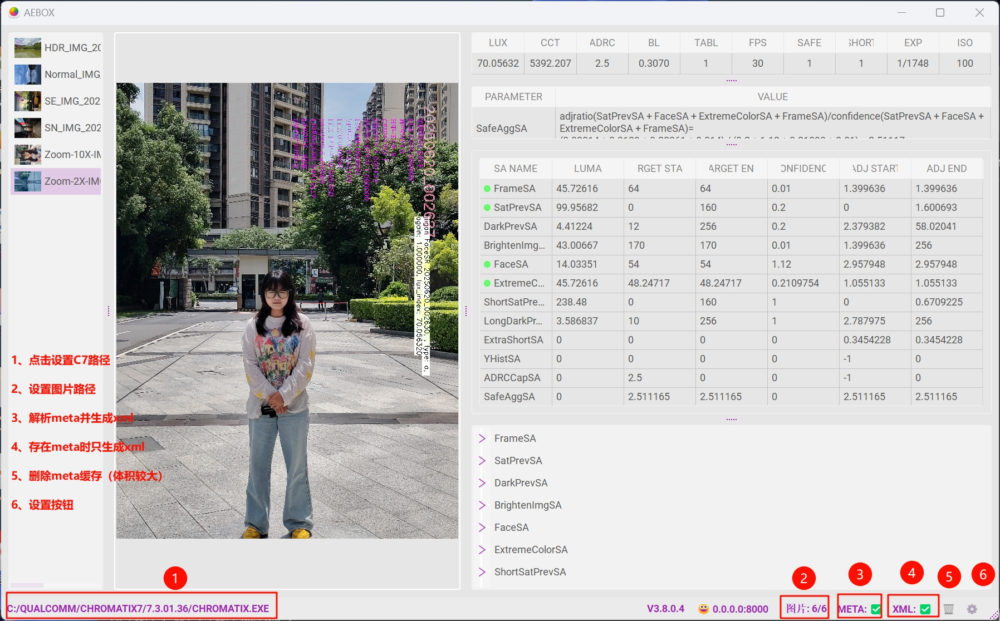

调试界面如果缩略图较多的情况打开比较慢，请耐心等待。

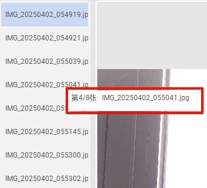
> 鼠标点击图片列表后，鼠标悬浮在对应的图片列表上，可以展示序号和完整文件名

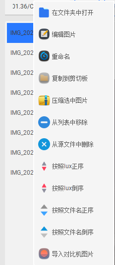

> 图片列表支持鼠标右键弹出相关功能列表，**列表中的图片也支持直接拖拽到C7工具中进行解析**。

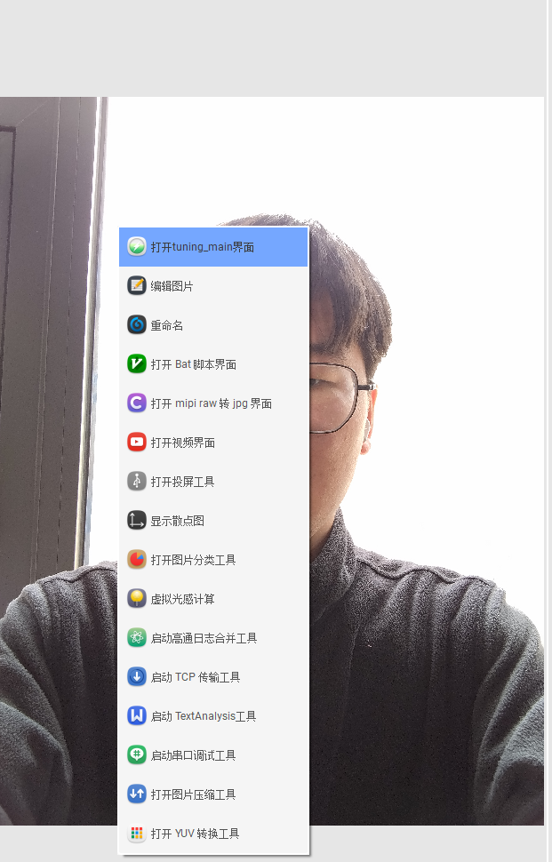

> 图片鼠标右键可以快捷打开工具菜单，支持快捷打开一些功能。

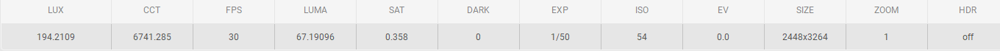

> 显示lux，cct等相关exif信息

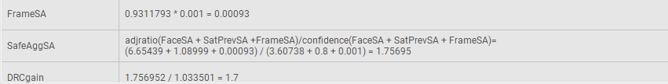

> safe聚合的计算过程以及adrc gain的数值。

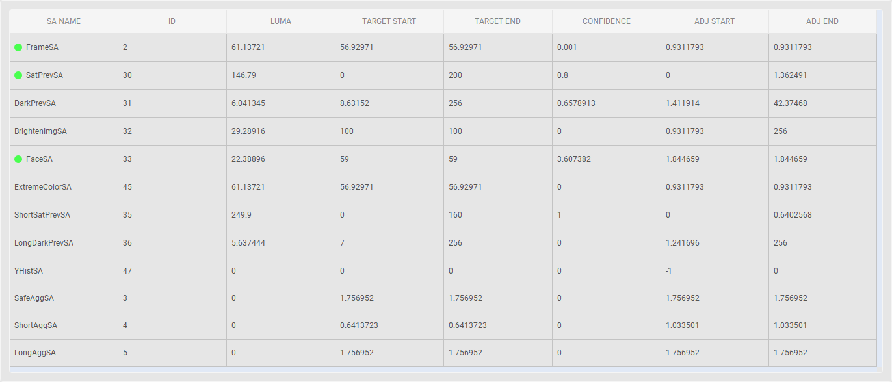

> sa的相关信息展示，sa带有绿色原点的参与聚合的。

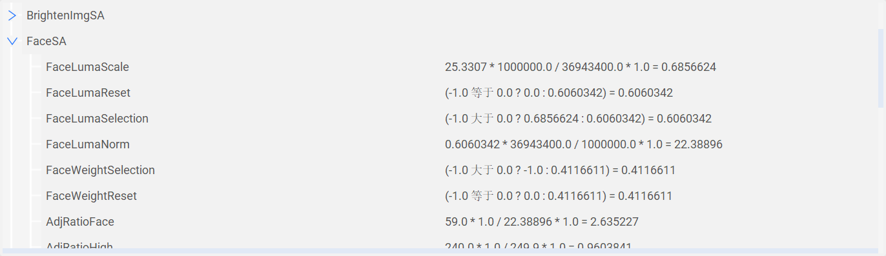

> sa各个步骤的操作名，操作数，操作方法，操作结果。**方便排查adjratio的计算过程。**

#### 2、mce测试使用步骤：

##### (1)点击c7路径选择c7工具，也可将地址粘贴到文本框内(不带双引号)

举例：C:\Qualcomm\Chromatix7\7.4.00.29\Chromatix.exe

##### (2)点击导入图片，将图片带有3a信息的图片文件夹放入。注意文件层级避免文件夹内嵌套文件夹。（也可以直接将图片文件夹直接拖入程序窗口内）

##### (3)解析meta，主要是调用c7解析图片的metadata信息，请耐心等待图片完成解析。才能继续执行后续步骤。

##### (4)解析xml，主要作用是将matadata中的关键信息提取并保存到新的xml中，此步骤比较慢，执行后稍等可以点击图片来显示ae的相关信息。

##### (5)Mcc 测试，用来自测mce中24色卡的亮度，对比度和18%灰的亮度。结果保存在程序所在路径下mcc_out中，注意图片的命名格式，

举例：A_5_Lux_xxxx.jpg
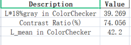

##### (6)Deadleaves 测试，主要是测试mce枯叶图的亮度。弹出枯叶图界面是，鼠标在指定区域框选，按下q重新框选，按下esc退出，按下enter开始统计。结果保存在程序路径下dead_leaves_data.xlsx。

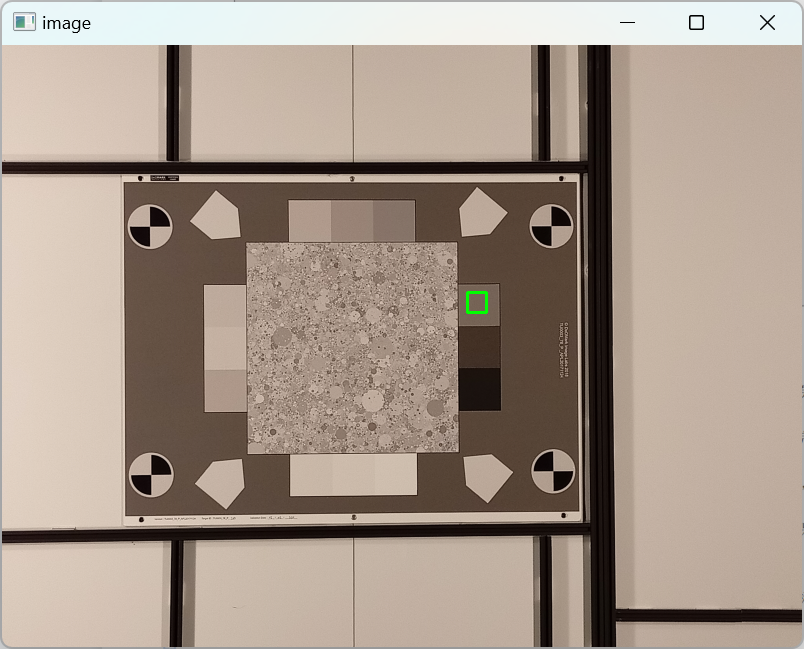

##### (7)Face 测试，主要是mce新增的人脸亮度测试项目，弹窗后使用鼠标框选人脸，眼睛到嘴巴下区域，按下q重新框选，按下esc退出，按下enter开始统计，结果保存在程序路径下face_data.txt。

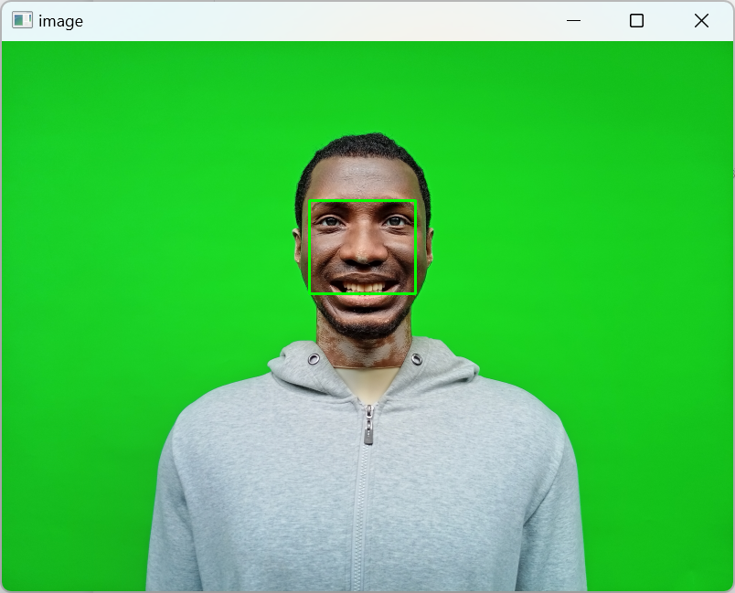

#### 3、快捷键

|      快捷键       |           功能           |
| :---------------: | :----------------------: |
|      Ctrl+A       |         旋转图片         |
|         P         |       局部信息统计       |
|         E         |     打开参数调试界面     |
|      Ctrl+U       |      图片调整/编辑       |
|         Q         |    播放/暂停全部视频     |
|         W         |       重播全部视频       |
| E（视频播放界面） |         快进0.1x         |
|         R         |         慢放0.1x         |
|         D         |         清空视频         |
|         T         | 设置基准并查找播放相似帧 |
|         Z         |  单帧后退            |
|         X         | 单帧快进            |
|         Ctrl+P    | exteremecolor落点图        |

---------------------------------------------------------------------

####  4、常见问题：

##### 1.xml解析不出来内容。

> a.SA的名字请保持和平台的一致！！！(framesa_tele_0310 被修改后，会被统一显示为Framesa，建议对于参数验证可以修改计算步骤，增加一步时间戳步骤)

> b.请关闭相关算法hdr等，使用normal拍照。

> c.请开启高通平台的3a或者是metadata。

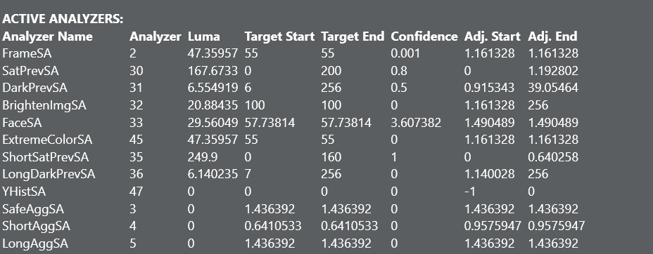

##### 2、打开tuning界面缓慢

> 当图片较多的时候需要生成图片缩略图和加载一些表格中的数据导致比较缓慢，请耐心等待。先使用快捷键i生成缩略图后，再打开tuning界面启动会快很多。

##### 3、页面显示内容不全。

> 可以手动缩放界面，也可以使用F11进行无边框全屏。

