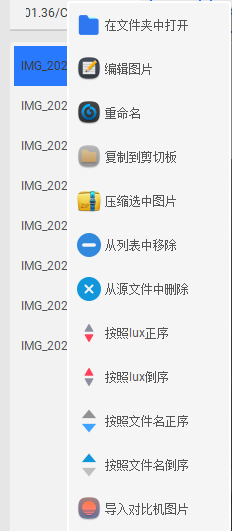

# 📷 Aebox

**Aebox**是一款多功能高通aec辅助调试工具集合，采用 **Python + PyQt5** 实现，旨在为AEC模块的同事提供丰富的辅助调试的工具，提高aec模块的调试效率，降低aec模块的上手难度。

  
  
    
  </a>
    

# 下载请查看最新的release
> https://github.com/965962591/aebox_releases/releases
# 使用指南：

#### 1、程序主页面

**增加aebox_lite更加轻量，专注于exif信息的显示。**

调试界面如果缩略图较多的情况打开比较慢，请耐心等待。

> 鼠标点击图片列表后，鼠标悬浮在对应的图片列表上，可以展示序号和完整文件名

> 图片列表支持鼠标右键弹出相关功能列表，**列表中的图片也支持直接拖拽到C7工具中进行解析**。

> 图片鼠标右键可以快捷打开工具菜单，支持快捷打开一些功能。

> 显示lux，cct等相关exif信息

> safe聚合的计算过程以及adrc gain的数值。

> sa的相关信息展示，sa带有绿色原点的参与聚合的。

> sa各个步骤的操作名，操作数，操作方法，操作结果。**方便排查adjratio的计算过程。**

#### 2、mce测试使用步骤：

##### (1)点击c7路径选择c7工具，也可将地址粘贴到文本框内(不带双引号)

举例：C:\Qualcomm\Chromatix7\7.4.00.29\Chromatix.exe

##### (2)点击导入图片，将图片带有3a信息的图片文件夹放入。注意文件层级避免文件夹内嵌套文件夹。（也可以直接将图片文件夹直接拖入程序窗口内）

##### (3)解析meta，主要是调用c7解析图片的metadata信息，请耐心等待图片完成解析。才能继续执行后续步骤。

##### (4)解析xml，主要作用是将matadata中的关键信息提取并保存到新的xml中，此步骤比较慢，执行后稍等可以点击图片来显示ae的相关信息。

##### (5)Mcc 测试，用来自测mce中24色卡的亮度，对比度和18%灰的亮度。结果保存在程序所在路径下mcc_out中，注意图片的命名格式，

举例：A_5_Lux_xxxx.jpg

##### (6)Deadleaves 测试，主要是测试mce枯叶图的亮度。弹出枯叶图界面是，鼠标在指定区域框选，按下q重新框选，按下esc退出，按下enter开始统计。结果保存在程序路径下dead_leaves_data.xlsx。

##### (7)Face 测试，主要是mce新增的人脸亮度测试项目，弹窗后使用鼠标框选人脸，眼睛到嘴巴下区域，按下q重新框选，按下esc退出，按下enter开始统计，结果保存在程序路径下face_data.txt。

#### 3、快捷键

|      快捷键       |           功能           |
| :---------------: | :----------------------: |
|      Ctrl+A       |         旋转图片         |
|         P         |       局部信息统计       |
|         E         |     打开参数调试界面     |
|      Ctrl+U       |      图片调整/编辑       |
|         Q         |    播放/暂停全部视频     |
|         W         |       重播全部视频       |
| E（视频播放界面） |         快进0.1x         |
|         R         |         慢放0.1x         |
|         D         |         清空视频         |
|         T         | 设置基准并查找播放相似帧 |
|         Z         |  单帧后退            |
|         X         | 单帧快进            |
|         Ctrl+P    | exteremecolor落点图        |

---------------------------------------------------------------------

####  4、常见问题：

##### 1.xml解析不出来内容。

> a.SA的名字请保持和平台的一致！！！

> b.请关闭相关算法hdr等，使用normal拍照。

> c.请开启高通平台的3a或者是metadata。

##### 2、打开tuning界面缓慢

> 当图片较多的时候需要生成图片缩略图和加载一些表格中的数据导致比较缓慢，请耐心等待。先使用快捷键i生成缩略图后，再打开tuning界面启动会快很多。

##### 3、页面显示内容不全。

> 可以手动缩放界面，也可以使用F11进行无边框全屏。

