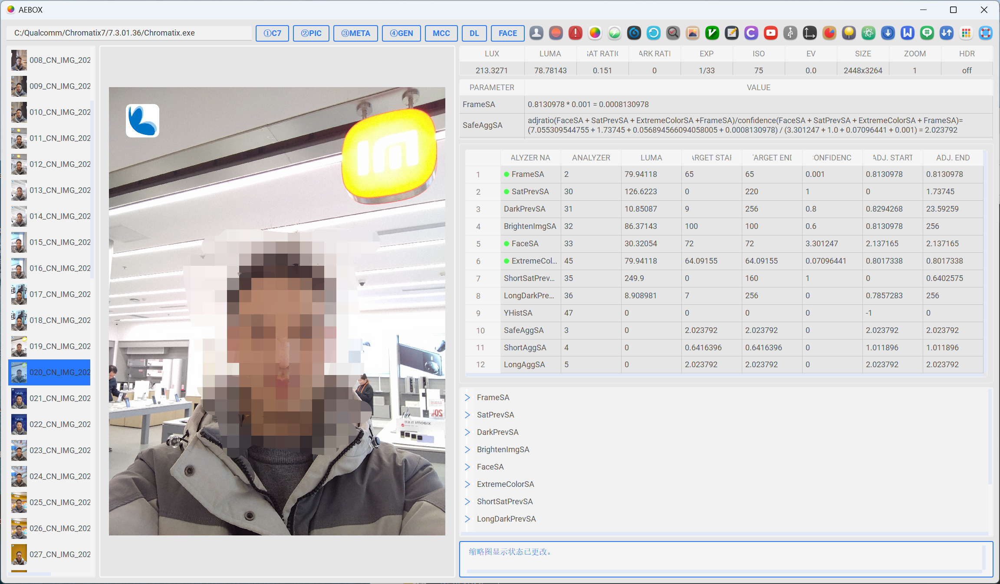
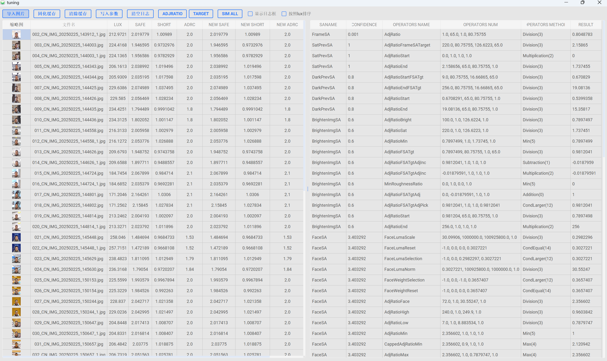
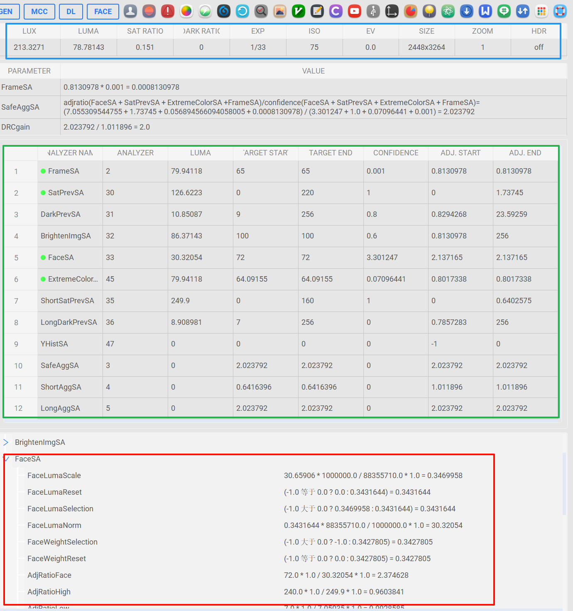

## 使用指南（仅支持aecx以上平台）
#### 1、程序主页面

#### 2、使用步骤：

###### (1)点击①c7路径选择c7工具，也可将地址粘贴到文本框内(不带双引号)
举例：C:\Qualcomm\Chromatix7\7.4.00.29\Chromatix.exe
###### (2)点击②导入图片，将图片带有3a信息的图片文件夹放入。注意文件层级避免文件夹内嵌套文件夹。（也可以直接将图片文件夹直接拖入程序窗口内）
###### (3)③解析meta，主要是调用c7解析图片的metadata信息，请耐心等待图片完成解析。才能继续执行后续步骤。
###### (4)④解析xml，主要作用是将matadata中的关键信息提取并保存到新的xml中，此步骤比较慢，执行后稍等可以点击图片来显示ae的相关信息。
###### (5)Mcc 测试，用来自测mce中24色卡的亮度，对比度和18%灰的亮度。结果保存在程序所在路径下mcc_out中，注意图片的命名格式，
举例：A_5_Lux_xxxx.jpg

###### (6)Deadleaves 测试，主要是测试mce枯叶图的亮度。弹出枯叶图界面是，鼠标在指定区域框选，按下q重新框选，按下esc退出，按下enter开始统计。结果保存在程序路径下dead_leaves_data.xlsx。

###### (7)Face 测试，主要是mce新增的人脸亮度测试项目，弹窗后使用鼠标框选人脸，眼睛到嘴巴下区域，按下q重新框选，按下esc退出，按下enter开始统计，结果保存在程序路径下face_data.txt。

#### 3、快捷键：
###### (1)快捷键i：按下i则显示图片缩略图，再次按下i则关闭。（按一次即可，当图片比较多的时候处理需要一点时间，请耐心等待）
###### (2)快捷键P：按下后图片区域鼠标框选roi，在log显示区域，展示rgb,l以及LAB值

###### (3)快捷键E：按下后稍等会弹出参数编辑界面，修改后部分数值修改会被覆盖的原因是，该数值是上一步计算的结果，所以请追溯源头。很多数值我做了表格上的关联，修改framesa会将表格中全部和framesa关联的数据都做修改，confidence也是如此，修改后先点击一下其他sa的数据，然后在点击enter就会触发计算。并更新表格中的数据。
###### (4)快捷键ctrl+a：逆时针旋转图片
