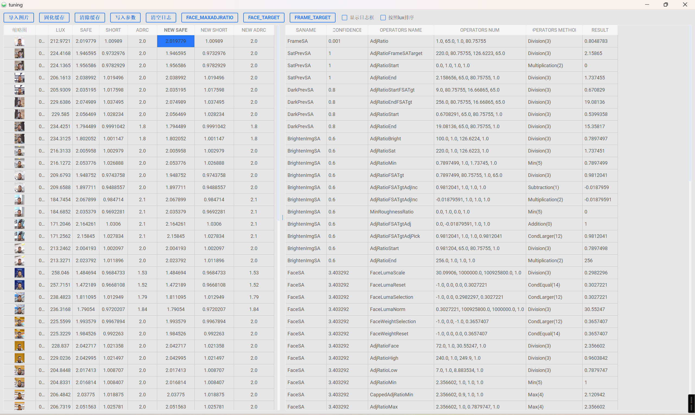

# 📷 Aebox

**Aebox**是一款多功能高通aec辅助调试工具集合，采用 **Python + PyQt5** 实现，旨在为AEC模块的同事提供丰富的辅助调试的工具，提高aec模块的调试效率，降低aec模块的上手难度。

  
  

# 使用指南：

#### 1、程序主页面

调试界面如果缩略图较多的情况打开比较慢，请耐心等待。

> 鼠标点击图片列表后，鼠标悬浮在对应的图片列表上，可以展示序号和完整文件名

> 图片列表支持鼠标右键弹出相关功能列表，**列表中的图片也支持直接拖拽到C7工具中进行解析**。

> 图片鼠标右键可以快捷打开工具菜单，支持快捷打开一些功能。

> 显示lux，cct等相关exif信息

> safe聚合的计算过程以及adrc gain的数值。

> sa的相关信息展示，sa带有绿色原点的参与聚合的。

> sa各个步骤的操作名，操作数，操作方法，操作结果。**方便排查adjratio的计算过程。**

#### 2、mce测试使用步骤：

##### (1)点击c7路径选择c7工具，也可将地址粘贴到文本框内(不带双引号)

举例：C:\Qualcomm\Chromatix7\7.4.00.29\Chromatix.exe

##### (2)点击导入图片，将图片带有3a信息的图片文件夹放入。注意文件层级避免文件夹内嵌套文件夹。（也可以直接将图片文件夹直接拖入程序窗口内）

##### (3)解析meta，主要是调用c7解析图片的metadata信息，请耐心等待图片完成解析。才能继续执行后续步骤。

##### (4)解析xml，主要作用是将matadata中的关键信息提取并保存到新的xml中，此步骤比较慢，执行后稍等可以点击图片来显示ae的相关信息。

##### (5)Mcc 测试，用来自测mce中24色卡的亮度，对比度和18%灰的亮度。结果保存在程序所在路径下mcc_out中，注意图片的命名格式，

举例：A_5_Lux_xxxx.jpg

##### (6)Deadleaves 测试，主要是测试mce枯叶图的亮度。弹出枯叶图界面是，鼠标在指定区域框选，按下q重新框选，按下esc退出，按下enter开始统计。结果保存在程序路径下dead_leaves_data.xlsx。

##### (7)Face 测试，主要是mce新增的人脸亮度测试项目，弹窗后使用鼠标框选人脸，眼睛到嘴巴下区域，按下q重新框选，按下esc退出，按下enter开始统计，结果保存在程序路径下face_data.txt。

#### 3、快捷键

|      快捷键       |           功能           |
| :---------------: | :----------------------: |
|      Ctrl+A       |         旋转图片         |
|         P         |       局部信息统计       |
|         E         |     打开参数调试界面     |
|      Ctrl+U       |      图片调整/编辑       |
|         Q         |    播放/暂停全部视频     |
|         W         |       重播全部视频       |
| E（视频播放界面） |         快进0.1x         |
|         R         |         慢放0.1x         |
|         D         |         清空视频         |
|         T         | 设置基准并查找播放相似帧 |
|         Z         |  单帧后退            |
|         X         | 单帧快进            |
|         Ctrl+P    | exteremecolor落点图        |

## 

####  4、更新日志：

##### 版本 3.6.7 (2025.03.28)

- 修复版本检查更新的逻辑。
- 修复导入其他文件再次解析时不显示进度问题。
- 增加更详细的使用指南和介绍。
- 落在缓冲区域的点也参与百分比计算。
- ui组件支持伸缩布局

##### 版本 3.6.6 (2025.03.28)
- 增加extremecolor落点百分比。
- 修改主程序初始化界面大小。
- 增加F11自动全屏显示。
- 优化主界面显示效果。
- 图片列表增加鼠标悬浮监听事件，显示图片index和完整文件名。
- 优化已知问题点。

##### 版本 3.6.5 (2025.03.25)
- 增加cct色温显示。
- 优化界面ui的显示，避免计算过程保留小数位数太多导致显示不全问题。
- 增加hiviewer问题点导入并显示，目前仅显示ae的问题点。
- 增加video按照帧快进和后退。快捷键x和z。
- 增加short/long/safe gain的表格导出功能。
- 优化xml解析时的内存占用，优化性能。
- 增加extremecolor的落点情况界面，快捷键ctrl+p

##### 版本 3.6.4 (2025.03.21)
- 修复拖入图片不显示的问题。
- 增加face的floor和cell参数调试功能。
- 新增tuning参数导入的功能。
- 修复face target写入不生效的问题。

##### 版本 3.6.2 (2025.03.10)
- 优化video播放器多视频播放时不同步的问题。
- 增加对比模式退出的功能。
- 修复导入的测试机和对比机的图片尺寸不同导致的视图错位问题。
- 新增文件避免重复导入不会跳过导致的重复解析问题。
- 修复已知问题。

##### 版本 3.6.1 (2025.03.07)

- 增加图片拖拽到其他窗口的功能。
- 集成update.exe完成增量更新。
- 图片处理工具替换成三方工具，体积更小交互更优。
- 增加导入对比机图片文件夹，支持同图滑动对比功能。

##### 版本 3.6.0.1 (2025.03.05)

- 修复bgr和rgb转换导致的统计数值异常问题。
- 增加update.exe程序实现本地的增量更新（先关闭主程序！点击update.exe等待完成更新即可）。

##### 版本 3.6.0 (2025.03.03)
- 增加sim all功能，支持批量模拟计算功能。
- 优化导入png等非jpg格式图片导致的程序崩溃问题。
- 聚合adjratio/target的调试参数界面，优化显示效果。
- 优化按照文件名排序时的异常问题。

##### 版本 3.5.6.7 (2025.03.02)
- 增加dark_prev_target和dark_maxadjratio的调试参数界面。
- 增加sat_prev_target的调试参数界面。
- 增加sat_maxadjratio/dark_maxadjratio的调试参数界面。
- 增加bright_image_target的调试参数界面。
- 优化并修复已知问题。

##### 版本 3.5.6.5 (2025.02.28)
- 增加图片复制到windows剪切板功能。
- 增加按照lux和文件名进行排序的功能。
- 增加图片没有3a信息时，不显示相关区域和信息,提示用户图片没有相关信息。
- 优化并修复已知问题。

##### 版本 3.5.6.4 (2025.02.27)
- 优化video的内存泄漏问题。
- 增加更丰富的配色方案，调整icon和按钮文案。
- 优化lab显示效果，默认显示全图的lab值。
- 增加全局的鼠标右键，弹出相关功能菜单。
- 图片列表支持ctrl/shift多选，实现图片压缩，移除，删除功能。
- 图片显示支持ctrl+鼠标滚轮进行放大缩小（以鼠标为中心缩放）。
- 修复roi统计时r和b数值取反的问题。
- 优化并修复已知问题。

##### 版本 3.5.1 (2025.02.13)
- 优化并修复已知问题。
- 增加虚拟光感标定系数A和B的计算。
- 增加高通离线log的合并。
- 优化xml的解析速度和流程。
- 优化about界面的显示效果。

 ##### 版本 3.4.8 (2025.02.09)
 - 添加了图片压缩工具。
 - 添加了yuv转换工具。
 - 优化并修复已知问题。

### 版本 3.4.7 (2025.02.07)
 - 添加了深色模式支持。
 - 更新了关于对话框的信息。
 - 改进了日志显示功能。
 - 修复了导入图片时的崩溃问题。
 - 增加了新的图片分类功能。
 - 优化了UI界面的响应速度。
 - 增加了github主页。
 - 优化并修复已知问题。

---------------------------------------------------------------------

####  4、常见问题：

##### 1.xml解析不出来内容。

> a.SA的名字请保持和平台的一致！！！

> b.请关闭相关算法hdr等，使用normal拍照。

> c.请开启高通平台的3a或者是metadata。

##### 2、打开tuning界面缓慢

> 当图片较多的时候需要生成图片缩略图和加载一些表格中的数据导致比较缓慢，请耐心等待。先使用快捷键i生成缩略图后，再打开tuning界面启动会快很多。

##### 3、页面显示内容不全。

> 可以手动缩放界面，也可以使用F11进行无边框全屏。

